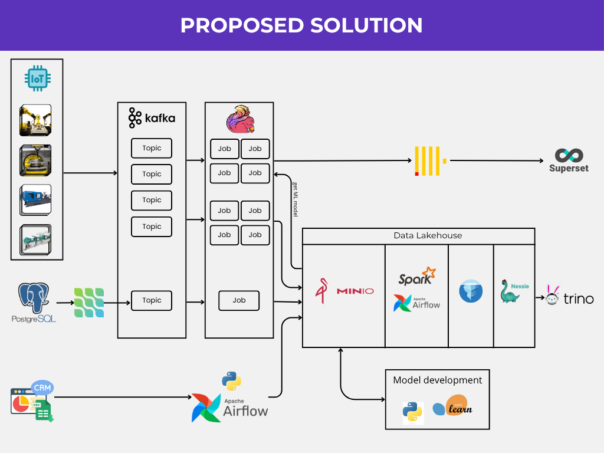

# Data Lakehouse Project for Automotive Manufacturing

## **Overview**

This project demonstrates the development of a modern, end-to-end data pipeline using a **Data Lakehouse** architecture, with a specific case study focused on **Chinese automotive manufacturers establishing factories in Indonesia**. As Indonesia targets over 2 million electric cars on the road by 2030, Chinese brands like Wuling, BYD, and Chery are setting up local production. To compete effectively in the price-sensitive Indonesian market and build long-term consumer trust, maintaining high quality control and consistent production is crucial. This project is designed to tackle the core operational challenges these new factories will face.

### Business Challenges
Manufacturing plants face two primary challenges:
1.  **Unexpected Machine Failures:** Although production machinery is equipped with IoT sensors, the data is typically used only for monitoring rather than for predictive purposes. As a result, potential issues often go unnoticed until they cause costly breakdowns, leading to expensive production halts and impacting cost efficiency.
2.  **Siloed Data Systems:** Supply chain data is stored in legacy databases, while sales and customer demand insights reside in separate CRM systems. Without seamless integration, manufacturers struggle to accurately align production schedules with market demand, hindering their ability to scale up and meet production targets.

### Data Engineering Solution
To address these challenges, this project propose a data engineering solution by building a centralized data platform. This platform integrates data from various sources (IoT, legacy databases, and CRM) into a **Data Lakehouse**. This architecture not only unifies the data but also enables advanced analytics, such as predictive maintenance for production machinery and more accurate sales forecasting for business planning.


## **Project Goals**

* **Build a Centralized Data Platform:** Integrate data from siloed sources (IoT, PostgreSQL, CRM) into a reliable single source of truth.
* **Implement Predictive Maintenance:** Transform IoT sensor data from simple monitoring feeds into predictive insights to reduce machine downtime.
* **Improve Forecasting Accuracy:** Align sales and supply chain data to enhance the accuracy of market demand forecasting and production planning.
* **Design a Scalable Architecture:** Establish a modern and scalable data foundation using Data Lakehouse technology with Apache Iceberg to support future business growth.


## **Solution**

The data pipeline architecture is designed to handle both real-time and batch data, with the Data Lakehouse at its core.



**Architecture Workflow:**
1.  **Data Sources:** Data originates from three main sources: **IoT** sensors on factory machines, **PostgreSQL** for supply chain data, and a **CRM** for sales data.
2.  **Data Ingestion:**
    * Streaming IoT data is sent through **Apache Kafka**.
    * Batch data from the CRM and PostgreSQL is ingested using the **Apache Airflow** workflow orchestrator.
3.  **Processing & Transformation:**
    * Streaming data from Kafka is processed by Spark Streaming/Flink jobs.
    * Airflow orchestrates data transformation (ETL/ELT) jobs using **Apache Spark**.
4.  **Storage (Data Lakehouse):**
    * **MinIO** serves as an S3-compatible object storage layer for all data.
    * **Apache Iceberg** acts as the open table format on top of MinIO, providing critical features like ACID transactions, schema evolution, and time travel.
    * **Nessie** functions as a catalog for Iceberg, enabling Git-like data semantics (e.g., branching, tagging, merging).
5.  **Model Development & Analysis:**
    * Data from the Lakehouse is used to train machine learning models (e.g., for predictive maintenance) with **Python** and **Scikit-learn**. The resulting models are then integrated back into the pipeline.
    * **Trino** is used as the query engine for fast, ad-hoc analytics directly on the Data Lakehouse.
6.  **Visualization & Reporting:**
    * **Apache Superset** connects to Trino to create interactive dashboards and business reports, such as OEE (Overall Equipment Effectiveness) monitoring or sales trend visualizations.


## **Key Features**

* **Real-time and Batch Ingestion:** Capable of handling high-velocity data from IoT sensors and transactional data from business systems.
* **Data Lakehouse Platform with Apache Iceberg:** Provides data warehouse-level reliability (ACID, DML) with the scalability and flexibility of a data lake.
* **"Git-like" Data Management:** Uses Nessie for reliable data versioning, ensuring data consistency and reproducibility.
* **Reliable Pipeline Orchestration:** The entire data pipeline is centrally orchestrated and scheduled using Apache Airflow.
* **Fast and Interactive Analytics:** Allows analysts and data scientists to run complex SQL queries quickly using Trino without moving data.
* **Full Machine Learning Lifecycle:** Supports the end-to-end process from model development and deployment to leveraging model outputs for decision-making.


## **Cloud Expansion: Car Dealership Service Network**

As the manufacturing operations stabilize, the project scope has expanded to the **after-sales service network**. We are now ingesting data from car dealership service centers across Indonesia to analyze vehicle performance in the real world.

### **Service Records Business Process**
When a customer brings their vehicle to a dealership for maintenance or repair, a **Service Record** is generated. This record contains critical information:
*   **Vehicle Details:** VIN, odometer reading, model.
*   **Service Details:** Services performed (e.g., "Brake Pad Replacement"), parts replaced, and technician notes.
*   **Dealer & Customer Info:** Location of the service and customer demographics.

Unlike the structured data from factory robots, this data is semi-structured and arrives in unpredictable bursts from various locations.

### **AWS Cloud Architecture**
To handle this variable workload, we implemented a **Serverless Data Pipeline** on AWS.


**Quick Flow Overview:**
1.  **Ingest:** Dealerships push JSON data to a secure **API Gateway**.
2.  **Buffer:** **SQS** queues incoming data to prevent system overload.
3.  **Process:** **ECS Fargate** containers spin up on-demand to validate and transform the data.
4.  **Store:** Validated data is loaded into **DynamoDB** for operational access and **S3** for long-term analytics.

👉 **[Click here for the full AWS Project Documentation and Setup Guide](./aws/README.md)**


## **Project Set Up**

### Prerequisites
* Docker Desktop

### Installation Steps

1.  Clone This Repository
    ```bash
    git clone https://github.com/ArkanNibrastama/carFactoryDataPipeline.git
    cd carFactoryDataPipeline
    ```

2. Set up credentials with your own key
    ```python
    # /airflow/dags/load_gsheet_data.py
    GSHEET_ID = "{YOUR_GSHEET_ID}"
    ```

2.  Run All Services
    ```bash
    docker-compose --profile default up -d
    ```

    Or run per section
    
    ```bash
    docker-compose --profile streamProcessing up -d
    ```
    ```bash
    docker-compose --profile cdc up -d 
    ```
    ```bash
    docker-compose --profile batchProcessing up -d 
    ```
    ```bash
    docker-compose --profile lakehouse up -d 
    ```

4.  Verify the Installation
    * Access the service UIs:
        * **MinIO Console:** http://localhost:9002
        * **Airflow UI:** http://localhost:8080
        * **Superset UI:** http://localhost:8088
        * **Nessie UI:** http://localhost:19120


## **Conclusion**

This project demonstrates how a modern Data Lakehouse architecture can effectively solve real-world challenges in the manufacturing industry. By integrating previously siloed data and leveraging it for predictive analytics, companies can significantly reduce operational costs, improve production efficiency, and make smarter, data-driven business decisions.
